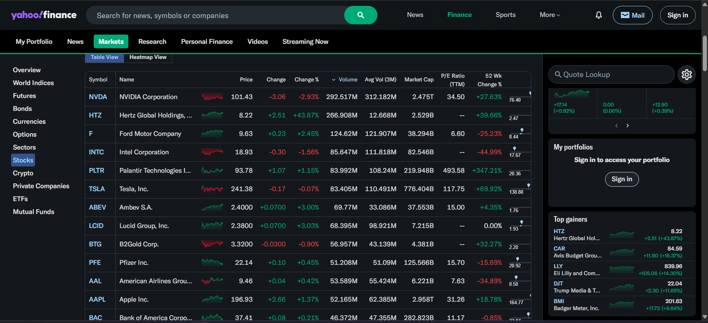

# 💹 Yahoo Finance Scraper


A Python-based web scraper to extract real-time and historical financial data 📈 from [Yahoo Finance](https://finance.yahoo.com/). Perfect for traders, analysts, or data enthusiasts looking to automate financial data collection.

---

## 🎥 Demo
# Click on the image to watch video

[](https://youtu.be/PBeBsxIbzp8)

---

## ⚙️ Features

- 📊 Extracts:
  - Stock prices (real-time & historical)
  - Market cap, P/E ratio, volume, etc.
  - Company info and financials
- 🗃️ Save to CSV / JSON / DataFrames
- 🔁 Handles multiple tickers at once
- ⏰ Scheduled scraping option
- 💡 Easy to integrate with dashboards or ML models

---

## 📦 Requirements

- `Python 3.7+`
- `requests`
- `beautifulsoup4`
- `pandas`
- `selenium`
  
---

## 🏗️ Project structure 
``` css
📦 yahoo-finance-scraper/
├── 📜 scraper.py         — Main script
├── 📓 analysis.ipynb     — Analysis file (Jupyter Notebook)
├── 📁 stock_data.xlsx    — Scraped data output
└── 📘 README.md          — Project documentation


